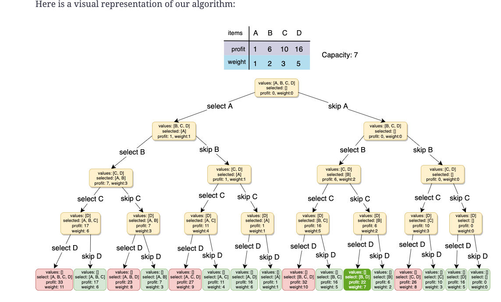

# DP 

## 1. Introduction




### Dynamic Programming Methods

#### 1. Top-down with Memoization

- we try to solve the bigger problem by recursively finding the solution to smaller sub-problems

```python
def calculateFibonacci(n):
  memoize = [-1 for x in range(n+1)]
  return calculateFibonacciRecur(memoize, n)


def calculateFibonacciRecur(memoize, n):
  if n < 2:
    return n

  # if we have already solved this subproblem, simply return the result from the cache
  if memoize[n] >= 0:
    return memoize[n]

  memoize[n] = calculateFibonacciRecur(
    memoize, n - 1) + calculateFibonacciRecur(memoize, n - 2)
  return memoize[n]

```

#### 2. Bottom-up with Tabulation

- In this approach, we solve the problem “bottom-up” (i.e. by solving all the related sub-problems first). This is typically done by filling up an n-dimensional table.

```python
def calculateFibonacci(n):
  dp = [0, 1]
  for i in range(2, n + 1):
    dp.append(dp[i - 1] + dp[i - 2])

  return dp[n]
```

## 2. 0/1 Knapsack

### 0/1 Knapsack Problem

Given the weights and profits of ‘N’ items, we are asked to put these items in a knapsack which has a capacity ‘C’. The goal is to get the maximum profit from the items in the knapsack. Each item can only be selected once, as we don’t have multiple quantities of any item.

Let’s take the example of Merry, who wants to carry some fruits in the knapsack to get maximum profit. Here are the weights and profits of the fruits:

**Items:** { Apple, Orange, Banana, Melon }
**Weights:** { 2, 3, 1, 4 }
**Profits:** { 4, 5, 3, 7 }
**Knapsack capacity:** 5

#### Brute-force Solution

- Time (2^*n*)+(2^*n*)−1, which is asymptotically equivalent to O(2^n)*O*(2^*n*).
- The space complexity is *O*(*n*). This space will be used to store the recursion stack.

```python 
def solve_knapsack(profits, weights, capacity):
  return knapsack_recursive(profits, weights, capacity, 0)


def knapsack_recursive(profits, weights, capacity, currentIndex):
  # base checks
  if capacity <= 0 or currentIndex >= len(profits):
    return 0

  # recursive call after choosing the element at the currentIndex
  # if the weight of the element at currentIndex exceeds the capacity, we  shouldn't process this
  profit1 = 0
  if weights[currentIndex] <= capacity:
    profit1 = profits[currentIndex] + knapsack_recursive(profits, weights, capacity - weights[currentIndex], currentIndex + 1)

  # recursive call after excluding the element at the currentIndex
  profit2 = knapsack_recursive(profits, weights, capacity, currentIndex + 1)

  return max(profit1, profit2)
```

#### Top-down Dynamic Programming with Memoization

Since our memoization array `dp[profits.length][capacity+1]` stores the results for all the subproblems, we can conclude that we will not have more than O(N*C ) subproblems (where ‘N’ is the number of items and ‘C’ is the knapsack capacity). This means that our time complexity will be O(N*C).

The above algorithm will be using O(N*C)*space for the memoization array. Other than that we will use O(N) space for the recursion call-stack. So the total space complexity will be O(N*C + N)*, which is asymptotically equivalent to O(N*C). 

```python
def solve_knapsack(profits, weights, capacity):
  # create a two dimensional array for Memoization, each element is initialized to '-1'
  dp = [[-1 for x in range(capacity+1)] for y in range(len(profits))]
  return knapsack_recursive(dp, profits, weights, capacity, 0)


def knapsack_recursive(dp, profits, weights, capacity, currentIndex):

  # base checks
  if capacity <= 0 or currentIndex >= len(profits):
    return 0

  # if we have already solved a similar problem, return the result from memory
  if dp[currentIndex][capacity] != -1:
    return dp[currentIndex][capacity]

  # recursive call after choosing the element at the currentIndex
  # if the weight of the element at currentIndex exceeds the capacity, we
  # shouldn't process this
  profit1 = 0
  if weights[currentIndex] <= capacity:
    profit1 = profits[currentIndex] + knapsack_recursive(
      dp, profits, weights, capacity - weights[currentIndex], currentIndex + 1)

  # recursive call after excluding the element at the currentIndex
  profit2 = knapsack_recursive(dp, profits, weights, capacity, currentIndex + 1)

  dp[currentIndex][capacity] = max(profit1, profit2)
  return dp[currentIndex][capacity]
```

#### Bottom-up Dynamic Programming

- `dp[i][c]` will represent the maximum knapsack profit for capacity ‘c’ calculated from the first ‘i’ items.
- The above solution has time and space complexity of O(N*C)* where ‘N’ represents total items and ‘C’ is the maximum capacity.

```python
def solve_knapsack(profits, weights, capacity):
  # basic checks
  n = len(profits)
  if capacity <= 0 or n == 0 or len(weights) != n:
    return 0

  dp = [[0 for x in range(capacity+1)] for y in range(n)]

  # populate the capacity = 0 columns, with '0' capacity we have '0' profit
  for i in range(0, n):
    dp[i][0] = 0

  # if we have only one weight, we will take it if it is not more than the capacity
  for c in range(0, capacity+1):
    if weights[0] <= c:
      dp[0][c] = profits[0]

  # process all sub-arrays for all the capacities
  for i in range(1, n):
    for c in range(1, capacity+1):
      profit1, profit2 = 0, 0
      # include the item, if it is not more than the capacity
      if weights[i] <= c:
        profit1 = profits[i] + dp[i - 1][c - weights[i]]
      # exclude the item
      profit2 = dp[i - 1][c]
      # take maximum
      dp[i][c] = max(profit1, profit2)

  # maximum profit will be at the bottom-right corner.
  return dp[n - 1][capacity]
```

- optimize to space O(N)

```python
def solve_knapsack(profits, weights, capacity):
  # basic checks
  n = len(profits)
  if capacity <= 0 or n == 0 or len(weights) != n:
    return 0

  # we only need one previous row to find the optimal solution, overall we need '2' rows
  # the above solution is similar to the previous solution, the only difference is that
  # we use `i % 2` instead if `i` and `(i-1) % 2` instead if `i-1`
  dp = [[0 for x in range(capacity+1)] for y in range(2)]

  # if we have only one weight, we will take it if it is not more than the capacity
  for c in range(0, capacity+1):
    if weights[0] <= c:
      dp[0][c] = dp[1][c] = profits[0]

  # process all sub-arrays for all the capacities
  for i in range(1, n):
    for c in range(0, capacity+1):
      profit1, profit2 = 0, 0
      # include the item, if it is not more than the capacity
      if weights[i] <= c:
        profit1 = profits[i] + dp[(i - 1) % 2][c - weights[i]]
      # exclude the item
      profit2 = dp[(i - 1) % 2][c]
      # take maximum
      dp[i % 2][c] = max(profit1, profit2)

  return dp[(n - 1) % 2][capacity]
```

- optimize SPACE  O(C)

```PYTHON
def solve_knapsack(profits, weights, capacity):
  # basic checks
  n = len(profits)
  if capacity <= 0 or n == 0 or len(weights) != n:
    return 0

  dp = [0 for x in range(capacity+1)]

  # if we have only one weight, we will take it if it is not more than the capacity
  for c in range(0, capacity+1):
    if weights[0] <= c:
      dp[c] = profits[0]

  # process all sub-arrays for all the capacities
  for i in range(1, n):
    for c in range(capacity, -1, -1):
      profit1, profit2 = 0, 0
      # include the item, if it is not more than the capacity
      if weights[i] <= c:
        profit1 = profits[i] + dp[c - weights[i]]
      # exclude the item
      profit2 = dp[c]
      # take maximum
      dp[c] = max(profit1, profit2)

  return dp[capacity]
```

### Equal Subset Sum Partition

#### Problems 

- Given a set of positive numbers, find if we can partition it into two subsets such that the sum of elements in both the subsets is equal.

  ```
  Input: {1, 2, 3, 4}
  Output: True
  Explanation: The given set can be partitioned into two subsets with equal sum: {1, 4} & {2, 3}
  ```

#### Brute-force

The time complexity of the above algorithm is exponential O(2^n), where ‘n’ represents the total number. The space complexity is O(n), this memory which will be used to store the recursion stack.

```python
def can_partition(num):
  s = sum(num)
  # if 's' is a an odd number, we can't have two subsets with equal sum
  if s % 2 != 0:
    return False

  return can_partition_recursive(num, s / 2, 0)


def can_partition_recursive(num, sum, currentIndex):
  # base check
  if sum == 0:
    return True

  n = len(num)
  if n == 0 or currentIndex >= n:
    return False

  # recursive call after choosing the number at the `currentIndex`
  # if the number at `currentIndex` exceeds the sum, we shouldn't process this
  if num[currentIndex] <= sum:
    if(can_partition_recursive(num, sum - num[currentIndex], currentIndex + 1)):
      return True

  # recursive call after excluding the number at the 'currentIndex'
  return can_partition_recursive(num, sum, currentIndex + 1)
```

#### Top-down Dynamic Programming with Memoization

The above algorithm has time and space complexity of O(N*S)*, where ‘N’ represents total numbers and ‘S’ is the total sum of all the numbers.

```python
def can_partition(num):
  s = sum(num)

  # if 's' is a an odd number, we can't have two subsets with equal sum
  if s % 2 != 0:
    return False

  # initialize the 'dp' array, -1 for default, 1 for true and 0 for false
  dp = [[-1 for x in range(int(s/2)+1)] for y in range(len(num))]
  return True if can_partition_recursive(dp, num, int(s / 2), 0) == 1 else False


def can_partition_recursive(dp, num, sum, currentIndex):
  # base check
  if sum == 0:
    return 1

  n = len(num)
  if n == 0 or currentIndex >= n:
    return 0

  # if we have not already processed a similar problem
  if dp[currentIndex][sum] == -1:
    # recursive call after choosing the number at the currentIndex
    # if the number at currentIndex exceeds the sum, we shouldn't process this
    if num[currentIndex] <= sum:
      if can_partition_recursive(dp, num, sum - num[currentIndex], currentIndex + 1) == 1:
        dp[currentIndex][sum] = 1
        return 1

    # recursive call after excluding the number at the currentIndex
    dp[currentIndex][sum] = can_partition_recursive(dp, num, sum, currentIndex + 1)

  return dp[currentIndex][sum]

```

#### Bottom-up Dynamic Programming

- The above solution has time and space complexity of O(N*S)*, where ‘N’ represents total numbers and ‘S’ is the total sum of all the numbers.

```python
def can_partition(num):
  s = sum(num)

  # if 's' is a an odd number, we can't have two subsets with same total
  if s % 2 != 0:
    return False

  # we are trying to find a subset of given numbers that has a total sum of 's/2'.
  s = int(s / 2)

  n = len(num)
  dp = [[False for x in range(s+1)] for y in range(n)]

  # populate the sum=0 column, as we can always have '0' sum without including 
  # any element
  for i in range(0, n):
    dp[i][0] = True

  # with only one number, we can form a subset only when the required sum is
  # equal to its value
  for j in range(1, s+1):
    dp[0][j] = num[0] == j

  # process all subsets for all sums
  for i in range(1, n):
    for j in range(1, s+1):
      # if we can get the sum 'j' without the number at index 'i'
      if dp[i - 1][j]:
        dp[i][j] = dp[i - 1][j]
      elif j >= num[i]:  # else if we can find a subset to get the remaining sum
        dp[i][j] = dp[i - 1][j - num[i]]

  # the bottom-right corner will have our answer.
  return dp[n - 1][s]
```


## 3. Unbounded Knapsack

### Unbounded Knapsack Problem

- Given two integer arrays to represent weights and profits of ‘N’ items, we need to find a subset of these items which will give us maximum profit such that their cumulative weight is not more than a given number ‘C’. We can assume an infinite supply of item quantities; therefore, each item can be selected multiple times.

#### Bruteforce

```python
def solve_knapsack(profits, weights, capacity):
    res = 0 
    def dfs(idx, total_weight, total_profit):
        if total_weight < 0 or idx >= len(weights):
            return 0
        if total_weight == 0:
            return  max(res, total_profit)
        p1 = 0
        if total_weight >= weights[idx]:
            p1 = dfs(idx,  total_weight - weights[idx], total_profit + profits[idx])
        p2 = dfs(idx + 1, total_weight, total_profit)
        return max(p1, p2)
    return dfs(0, capacity, 0)
```

#### Top down with Memo

```python
def solve_knapsack(profits, weights, capacity):
  dp = [[-1 for _ in range(capacity+1)] for _ in range(len(profits))]
  return solve_knapsack_recursive(dp, profits, weights, capacity, 0)


def solve_knapsack_recursive(dp, profits, weights, capacity, currentIndex):
  n = len(profits)
  # base checks
  if capacity <= 0 or n == 0 or len(weights) != n or currentIndex >= n:
    return 0

  # check if we have not already processed a similar sub-problem
  if dp[currentIndex][capacity] == -1:
    # recursive call after choosing the items at the currentIndex, note that we
    # recursive call on all items as we did not increment currentIndex
    profit1 = 0
    if weights[currentIndex] <= capacity:
      profit1 = profits[currentIndex] + solve_knapsack_recursive(
        dp, profits, weights, capacity - weights[currentIndex], currentIndex)

    # recursive call after excluding the element at the currentIndex
    profit2 = solve_knapsack_recursive(
      dp, profits, weights, capacity, currentIndex + 1)

    dp[currentIndex][capacity] = max(profit1, profit2)

  return dp[currentIndex][capacity]
```

#### Bottom Up

```python
def solve_knapsack_bottom_up(profits, weights, capacity):
    m = len(profits)
    n = capacity + 1
    dp = [[-1 for i in range(n)] for j in range(m)]

    for i in range(m):
        dp[i][0] = 0 
    
    for i in range(m):
        for j in range(1, n):
            p1, p2 = 0, 0
            if j >= weights[i]:
                # since you can use countless time 
                # dp[i][j] = max(dp[i][j-weight[i]] + profits[i], dp[i-1][j])
                p1 = dp[i][j - weights[i]] + profits[i]
            if i > 0:
            		p2 = dp[i-1][j]
            dp[i][j] = max(p1, p2)
    return dp[m-1][capacity]
 
def solve_knapsack_bottom_up_space_optimization(profits, weights, capacity):
    m = len(profits)
    n = capacity + 1
    dp = [0 for i in range(n)]
    
    for i in range(m):
        for j in range(1, n):
            p1, p2 = 0, 0
            if j >= weights[i]:
                # since you can use countless time 
                p1 = dp[j - weights[i]] + profits[i]
            p2 = dp[j]
            dp[j] = max(p1, p2)
    return dp[-1]
```

### Coin change 

#### Problem

- Given an infinite supply of ‘n’ coin denominations and a total money amount, we are asked to find the total number of distinct ways to make up that amount.
- if money is 0, return 1, since there is always empty set for the answer. 

#### Solution 

```python
def count_change_top_down(denominations, total):
    def dfs(idx, total):
        n = len(denominations)
        if idx >= n or total < 0:
            return 0
        if total == 0:
            return 1
        if dp[idx][total] == -1:
            sum_val = 0 
            if total >= denominations[idx]:
                sum_val += dfs(idx, total - denominations[idx])
            sum_val += dfs(idx + 1, total)
            dp[idx][total] = sum_val
        return dp[idx][total]
    # dp[num][total]
    row_len = len(denominations)
    col_len = total + 1
    dp = [[-1 for i in range(col_len)] for j in range(row_len)]
    return dfs(0, total)

def count_change_bottom_up(denominations, total):
    # dp[num][total]
    row_len = len(denominations)
    col_len = total + 1
    dp = [[0 for i in range(col_len)] for j in range(row_len)]
     # populate the total = 0 columns, as we will always have an empty set for zero total
    for i in range(row_len):
        dp[i][0] = 1
    for i in range(row_len):
        for j in range(1, col_len):
            if i > 0:
                dp[i][j] = dp[i-1][j]
            if j >= denominations[i]:
                dp[i][j] += dp[i][j - denominations[i]]
    print(dp)
    return dp[-1][-1]
# return 5
print(count_change_bottom_up([1, 2, 3], 5))
```

### Minimum Coin Change

#### Problem 

- Given an infinite supply of ‘n’ coin denominations and a total money amount, we are asked to find the minimum number of coins needed to make up that amount.

- Notice the difference in the initialization part. 

  **Example 1:**

  ```
  Denominations: {1,2,3}
  Total amount: 5
  Output: 2
  Explanation: We need minimum of two coins {2,3} to make a total of '5'
  ```

#### Solution

```python
def count_change_top_down(denominations, total):
    def dfs(idx, total):
        if total == 0:
            return 0
        if idx >= len(denominations) or total < 0:
            return float("inf")
        
        if dp[idx][total] == -1:
            cnt1 = float("inf")
            if denominations[idx] <= total:
                cnt1 = dfs(idx, total - denominations[idx])
                if cnt1 != float("inf"):
                    cnt1 += 1 
            cnt2 = dfs(idx + 1, total)
            dp[idx][total] = min(cnt1, cnt2)
        return dp[idx][total] 

    row_len = len(denominations)
    col_len = total + 1
    dp = [[-1 for i in range(col_len)] for j in range(row_len)]
    return dfs(0, total)
  
def count_change_bottom_up(denominations, total):
    row_len = len(denominations)
    col_len = total + 1
    dp = [[float('inf') for i in range(col_len)] for j in range(row_len)]
    
    for i in range(row_len):
        dp[i][0] = 0 

    for i in range(row_len):
        for j in range(col_len):
            cnt1, cnt2 = float("inf"), float("inf")
            if j >= denominations[i]:
                cnt1 = dp[i][j-denominations[i]] + 1
            if i > 0:
                cnt2 = dp[i-1][j]
            dp[i][j] = min(cnt1, cnt2)
    return dp[-1][-1]
print(count_change_bottom_up([1, 2, 3], 5))
```

### Maximum Ribbon

#### Problem 

- We are given a ribbon of length ‘n’ and a set of possible ribbon lengths. Now we need to cut the ribbon into the maximum number of pieces that comply with the above-mentioned possible lengths. 

  Write a method that will return the count of pieces.

  ```tex
  n: 7
  Ribbon Lengths: {2,3}
  Output: 3
  Explanation: Ribbon pieces will be {2,2,3}.
  
  ```

- Main difference: initilization -float("inf")

#### Solution

```python
def count_ribbon_pieces_top_down(ribbonLengths, total):
    def dfs(idx,total):
        n = len(ribbonLengths)
        if idx >= n or total < 0:
            return -float("inf")
        if total == 0:
            return 0
        if dp[idx][total] == -1:
            cnt1, cnt2 = -float("inf"), -float("inf")
            if ribbonLengths[idx] <= total:
                cnt1 = dfs(idx, total - ribbonLengths[idx]) + 1
            cnt2 = dfs(idx + 1, total)
            dp[idx][total] = max(cnt1 , cnt2)
        return dp[idx][total]

    row_num = len(ribbonLengths)
    col_num = total + 1
    dp = [[-1 for i in range(col_num)] for j in range(row_num)]
    res = dfs(0, total)
    return res if res != -float("inf") else -1

def count_ribbon_pieces_bottom_up(ribbonLengths, total):
    row_num = len(ribbonLengths)
    col_num = total + 1
    dp = [[-float("inf") for i in range(col_num)] for j in range(row_num)]

    for i in range(row_num):
        dp[i][0] = 0

    for i in range(row_num):
        for j in range(1, col_num):
            if i > 0:
                dp[i][j] = dp[i-1][j]
            if ribbonLengths[i] <= j and dp[i][j-ribbonLengths[i]] != -float("inf"):
                dp[i][j] = max(dp[i][j], dp[i][j-ribbonLengths[i]] + 1)

    return dp[-1][-1] if dp[-1][-1] != -float("inf") else -1
print(count_ribbon_pieces_bottom_up([2, 3, 5], 5)) # 2
print(count_ribbon_pieces_bottom_up([3, 5], 7)) # -1
```

## 3. Fibonacci Sequence 

### Fibnoacci Number Problem

Fibonacci numbers are a series of numbers in which each number is the sum of the two preceding numbers

- 0,1,1,2,3,5,8,13..

```python
def calculateFibonacci_brute_force(n):
  O(n^2)
  if n < 2:
    return n

  return calculateFibonacci(n - 1) + calculateFibonacci(n - 2)
def calculateFibonacci(n):
  memoize = [-1 for x in range(n+1)]
  return calculateFibonacciRecur(memoize, n)


def calculateFibonacciRecur(memoize, n):
  if n < 2:
    return n

  # if we have already solved this subproblem, simply return the result from the cache
  if memoize[n] >= 0:
    return memoize[n]

  memoize[n] = calculateFibonacciRecur(
    memoize, n - 1) + calculateFibonacciRecur(memoize, n - 2)
  return memoize[n]

def calculateFibonacci_bottom_up(n):
  # O(n).
  if n < 2:
    return n
  dp = [0, 1]
  for i in range(2, n + 1):
    dp.append(dp[i - 1] + dp[i - 2])

  return dp[n]


```

