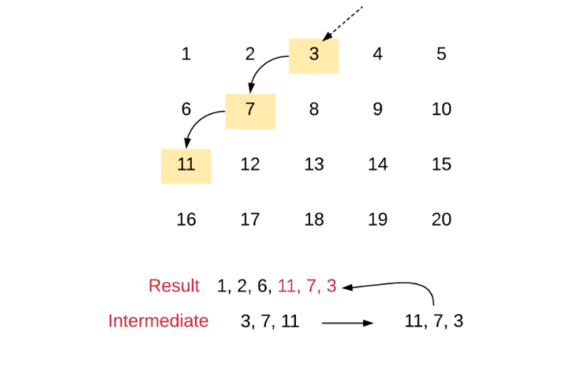
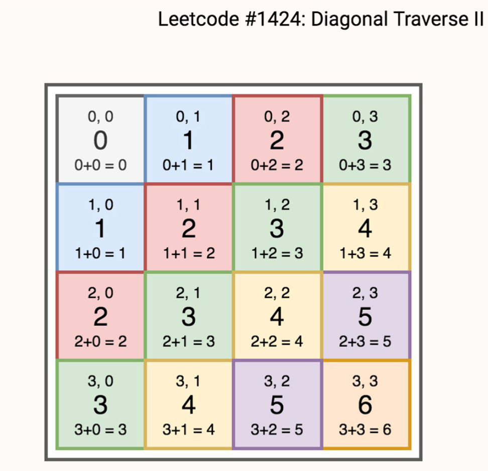

# Array

## 1. 2D Array

### 498. Diagonal Traverse




```python
class Solution:
    
    def findDiagonalOrder(self, matrix: List[List[int]]) -> List[int]:
        """
        :type matrix: List[List[int]]
        :rtype: List[int]
        [
         [ 1, 2, 3 ],
         [ 4, 5, 6 ],
         [ 7, 8, 9 ]
        ]
        
        """
        if not matrix or len(matrix) == 0:
            return []
        m, n = len(matrix), len(matrix[0])
        
        res = []
        row, col, d = 0,0,0
        dirs = [(-1, 1), (1, -1)]
        for i in range(m * n):
            res.append(matrix[row][col])
            row += dirs[d][0]
            col += dirs[d][1]
            
            if row >= m:
                row = m-1
                col += 2
                d = 1-d
            if col >= n:
                col = n -1
                row += 2
                d = 1- d
            if row < 0:
                row = 0
                d = 1-d
            if col < 0:
                col = 0
                d = 1-d
        return res
            
    def findDiagonalOrder2(self, matrix: List[List[int]]) -> List[int]:
        
        # Check for empty matrices
        if not matrix or not matrix[0]:
            return []
        
        # Variables to track the size of the matrix
        N, M = len(matrix), len(matrix[0])
        
        # The two arrays as explained in the algorithm
        result, intermediate = [], []
        
        # We have to go over all the elements in the first
        # row and the last column to cover all possible diagonals
        for d in range(N + M - 1):
            
            # Clear the intermediate array everytime we start
            # to process another diagonal
            intermediate.clear()
            
            # We need to figure out the "head" of this diagonal
            # The elements in the first row and the last column
            # are the respective heads.
            r, c = 0 if d < M else d - M + 1, d if d < M else M - 1
            
            # Iterate until one of the indices goes out of scope
            # Take note of the index math to go down the diagonal
            while r < N and c > -1:
                intermediate.append(matrix[r][c])
                r += 1
                c -= 1
            
            # Reverse even numbered diagonals. The
            # article says we have to reverse odd 
            # numbered articles but here, the numbering
            # is starting from 0 :P
            if d % 2 == 0:
                result.extend(intermediate[::-1])
            else:
                result.extend(intermediate)
        return result 
```

### 1424. Diagonal Traverse II



```python
class Solution:
    def findDiagonalOrder(self, nums: List[List[int]]) -> List[int]:
        from collections import defaultdict 
        from collections import deque
        d = defaultdict(deque)
        for i, row in enumerate(nums):
            for j, e in enumerate(row):
                d[i+j].appendleft(e)
        trav = []
        for key, diag in d.items():
            trav.extend(diag)
        return trav
```

### 54. Spiral Matrix

class Solution(object):
    def spiralOrder(self, matrix):
        """
        [
         [ 1, 2, 3 ],
         [ 4, 5, 6 ],
         [ 7, 8, 9 ]
        ]
        

```python
class Solution(object):
    def spiralOrder(self, matrix):
        """
        [
         [ 1, 2, 3 ],--->
         [ 4, 5, 6 ],|
         [ 7, 8, 9 ] |
         ----
        ]
        
        """
        if not matrix: return []
        R, C = len(matrix), len(matrix[0])
        seen = [[False] * C for _ in matrix]
        ans = []
        dr = [0, 1, 0, -1] # right, down, left, up, 
        dc = [1, 0, -1, 0]
        r = c = di = 0
        for _ in range(R * C):
            ans.append(matrix[r][c])
            seen[r][c] = True
            cr, cc = r + dr[di], c + dc[di]
            if 0 <= cr < R and 0 <= cc < C and not seen[cr][cc]:
                r, c = cr, cc
            else:
                di = (di + 1) % 4
                r, c = r + dr[di], c + dc[di]
        return ans
```
